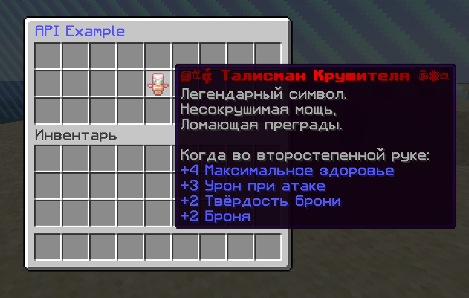

# ItemsAPI

Плагин для Minecraft серверов, предоставляющий API для управления пользовательскими предметами и их хранения в конфигурации.

## 📦 Функционал

- Сохранение, загрузка и выдача предметов через команды
- Простой API интерфейс для интеграции с плагинами
- Предметы сохраняются в конфигурационном файле

## 🔧 Команды
| Команда | Описание | Разрешение |
|---------|----------|------------|
| `/items give <игрок> <предмет>` | Выдать сохранённый предмет указанному игроку | `ItemsAPI.use` |
| `/items add` | Сохранить все предметы из вашего инвентаря | `ItemsAPI.use` |

## 💻 API для разработчиков
```java
// Получение экземпляра API:
@Override
public void onEnable() {
    itemsAPI = ItemsAPIProvider.getAPI();
}
```

```java
// Получение и выдача ItemStack предмета:
ItemStack needItem = itemsAPI.getItem("ТАЛИСМАН_КРУШИТЕЛЯ");

// Получить все сохранённые предметы
Map<String, ItemStack> allItems = api.getAllItems();
```

## ⭐ Пример использования в меню
```java
public class MenuPlugin extends JavaPlugin implements CommandExecutor {
    private ItemsAPIInterface itemsAPI;
    private final MiniMessage mm = MiniMessage.miniMessage();

    @Override
    public void onEnable() {
        itemsAPI = ItemsAPIProvider.getAPI();
        getServer().getPluginManager().registerEvents(this, this);
        getCommand("menu").setExecutor(this);
    }

    @Override
    public boolean onCommand(CommandSender sender, Command command, String label, String[] args) {
        if (!(sender instanceof Player player)) { return true; }

        Inventory inv = Bukkit.createInventory(player, 3*9, mm.deserialize("<blue>API Example</blue>"));
        inv.setItem(13, itemsAPI.getItem("ТАЛИСМАН_КРУШИТЕЛЯ"));
        player.openInventory(inv);
        
        return true;
    }
}
```



- Не забудьте в Вашем плагине в plugin.yml добавить ```depend: [ItemsAPI]```
- А также в build.gradle ```compileOnly files('libs/ItemsAPI-1.0.jar')```
### ⭐ Если вам нравится этот плагин, поставьте звезду на GitHub!
